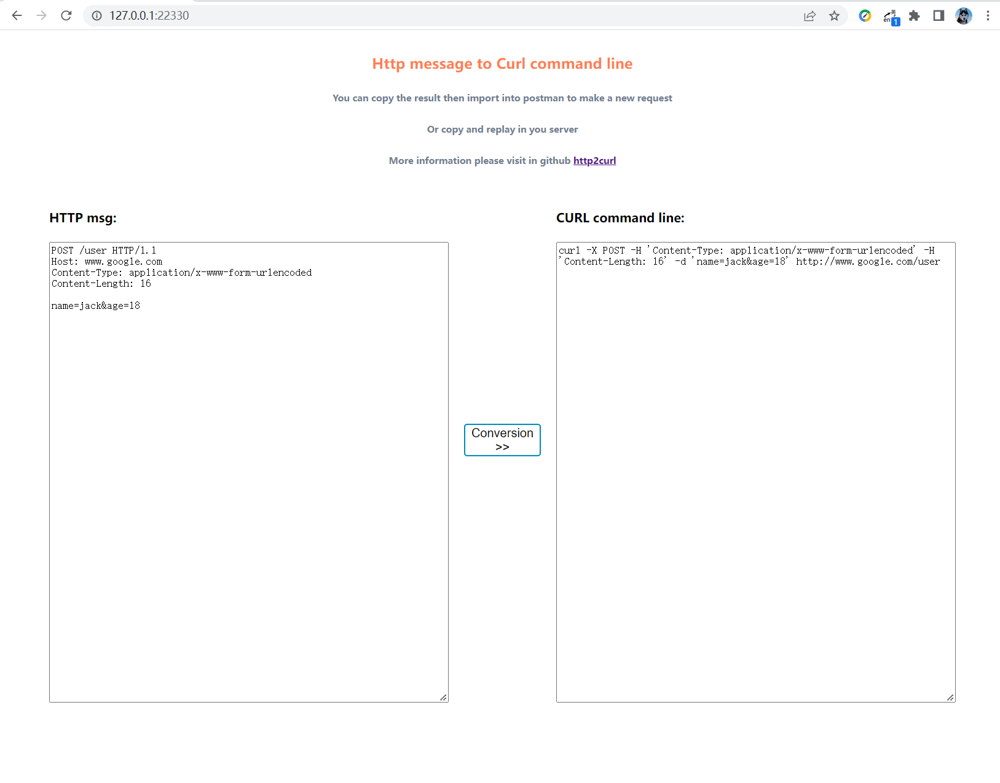

##### Translate to: [简体中文](README_zh.md)
### http2curl - A Tool for Converting HTTP Messages to Curl Commands
In our usual development and debugging process, we may need to replay requests based on the HTTP messages recorded in logs in order to locate issues. When dealing with HTTP messages that have long headers and bodies, it can be time-consuming and prone to errors if we manually write curl commands or construct them using tools like Postman.

**http2curl** can quickly convert the original HTTP messages into curl commands. You can take the generated curl command and execute it on the server or import it into Postman for further editing.

### Usage
**http2curl** provides two modes of conversion: **web mode** and **command-line mode**. Here, we highly recommend using the first mode, which allows for interactive usage through a web browser, making it simple and convenient.

#### Installing http2curl
You can download the appropriate version of http2curl from [releases](https://github.com/liaojiansong/http2curl/releases) and save it locally.

#### Web Mode
##### 1. Start a Local Web Service
Run `./http2curl serve` to start the web service. By default, it listens on port `22330` of the local machine, but you can also modify this using the `-p` option.

```shell
$ ./http2curl.exe serve
2022-06-20T15:20:45.455+0800    INFO    impl/serve.go:56        starting web serve      {"listen port": 22330}
```
##### 2. Open Browser at 127.0.0.1:22330
Open your browser and enter 127.0.0.1:22330 in the address bar. In the `HTTP msg` box, enter the original HTTP message and click on "Conversion" to perform the conversion.

#### Command-Line Mode
Run `./http2curl cli -f /home/example/httpmsg.txt` to use the command-line mode. The -f option is used to specify the file path where the HTTP message is stored. Note that each source file can only contain one HTTP message.

```shell
$ ./http2curl.exe cli -f /c/workplace/code/httpmsg.txt
curl -X POST -H 'Content-Length: 16' -H 'Content-Type: application/x-www-form-urlencoded' -d 'name=jack&age=18' http://www.google.com/user
```

#### Finally, if you find this tool useful, feel free to give it a **Star**. It means a lot to me.