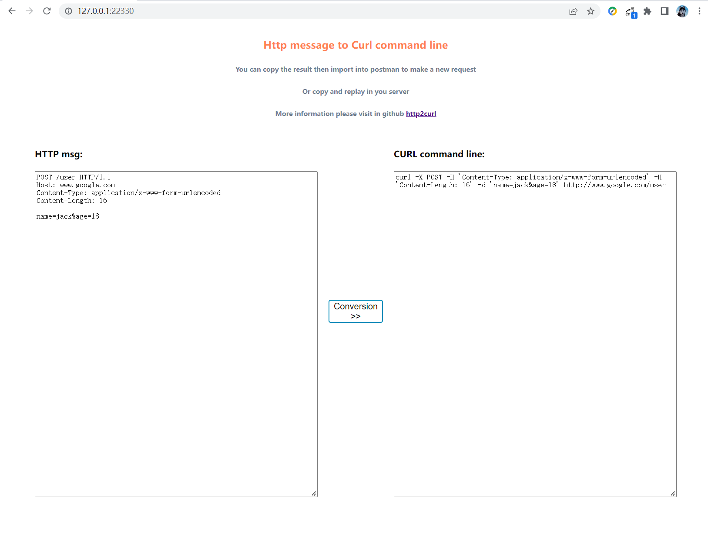

### http2curl 一款可以把http报文转为curl命令的工具
我们在平时的开发调试中，可能需要根据日志中记录的http报文对请求进行重放，以便于定位问题。面对一些拥有很长的header和body的http消息，
如果自己编写curl命令或者通过postman构造的话，可能会比较浪费时间且容易遗漏。<br>
**http2curl**可以快速地帮你将原始http报文转换为curl命令 ， 你可以拿转换后的curl命令到服务器上执行或者导入postman进行二次编辑

### 使用方式
**http2curl**提供了**web模式**和**命令行模式**两种方式进行转换，这里我们更加推荐使用第一种方式，通过浏览器进行交互使用，简单方便
#### 安装http2curl
你可以到[releases](https://github.com/liaojiansong/http2curl/releases)下载合适自己的http2curl版本到本地中
#### web模式
##### 1. 开启一个本地web服务
`./http2curl serve` 开启web服务，默认监听本地的`22330`端口，你也可以通过`-p`选项进行修改
```shell
$ ./http2curl.exe serve
2022-06-20T15:20:45.455+0800    INFO    impl/serve.go:56        starting web serve      {"listen port": 22330}
```
##### 2. 浏览器打开 127.0.0.1:22330
打开你的浏览器，地址栏输入127.0.0.1:22330。在 `HTTP msg`框输入原始的http报文然后点击conversion即可完成转换

#### 命令行模式
`./http2curl cli -f /home/example/httpmsg.txt` `-f` 选项用于指定存放http消息的文件路径，需要注意的是一个源文件中只能存放一条http消息
```shell
$ ./http2curl.exe cli -f /c/workplace/code/httpmsg.txt
curl -X POST -H 'Content-Length: 16' -H 'Content-Type: application/x-www-form-urlencoded' -d 'name=jack&age=18' http://www.google.com/user
```
#### 最后，如果你觉得这个工具对你有用的话，欢迎**Star**，这个对我很重要